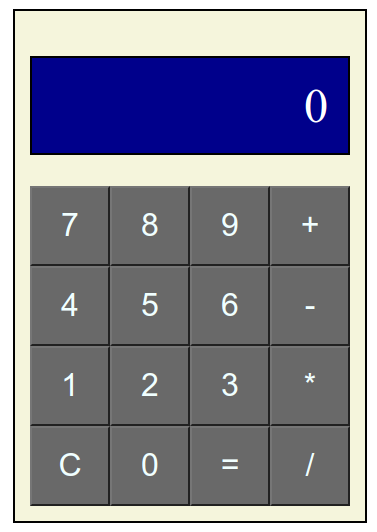

# Simple Calculator

## Following [TheOdinProject](https://www.theodinproject.com/lessons/foundations-calculator#assignment) lessons. This extremely simple calculator take a string, separate the operators with Regex, and then make the calculations.

 
